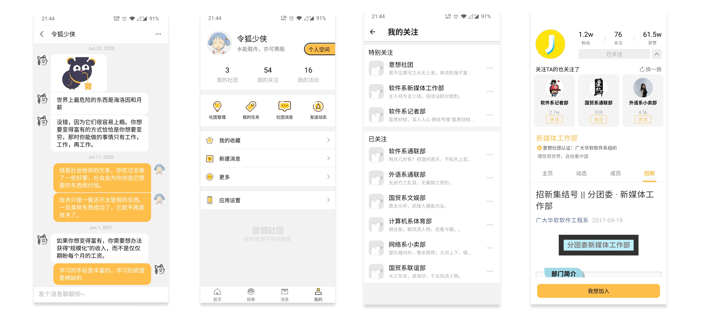

## 应用界面





## 项目介绍

`意想社团` 是我在大学期间开发的一个关于高校社团组织应用，为大学社团的招新和组织活动提供一个的宣传和推广平台，提供了高效、便捷的社团管理方式，优化了社团管理流程，让社团间的交流变得活跃和有趣！该应用主要功能包括社团申请、活动发布、群投票、动态推送、成员状态筛选等。

该应用获得过以下荣誉：

- 2019 年微信小程序应用开发赛华南赛区一等奖，[查看获奖证书](https://imgur.com/7JrrhYP)

- 第十六届 “青牛杯” 软件设计大赛三等奖

- 入选本校最高奖学金奖项名单并获奖

## 真机体验

安装包已在 GitHub 发布，[立即前往下载](https://github.com/Codennnn/eason-club/releases)

## 运行配置

```
# 安装依赖
yarn
# 启动本地运行程序
yarn android
```

## 生成发行 APK 包

```
# 进入根目录下的 android 文件夹
cd android
# 执行打包命令
./gradlew assembleRelease
```

生成的 APK 文件位于 `android/app/build/outputs/apk/release/app-release.apk`
